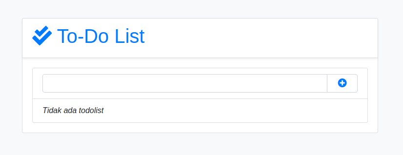

### Django App ToDo-List

#### How to run This Project

* git clone https://github.com/antheiz/Django-ToDo.git
* cd Django-ToDo
* python -m venv python-env
* source python-env/bin/activate/
* pip install -r requirements.txt
* python manage.py runserver
* open your browser and typing _localhost:8000_

### Thank You
* By Theiz Andatu
* With follow Guide on this Tutorial [YouTube](https://www.youtube.com/watch?v=aQak27DrAMw)